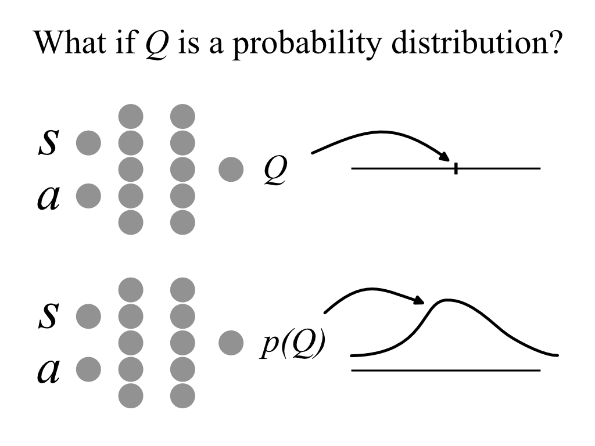
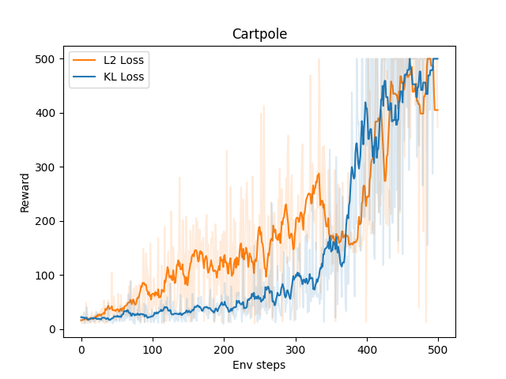

# Probabilistic Q-Learning

> [!NOTE]
> This is a weekend project I did to get my hands dirty for the first time with Reinforcement Learning.

Lately, I’ve been reading some papers about off-policy RL methods. They don’t work that well in practice.  

In standard Q-learning, people usually predict only the expected Q-value.  

So I thought: *is it possible to predict the entire probability distribution of Q?*  



The answer is **yes**. In this repository I’ll show you how to perform **probabilistic Q-learning from first principles**.


# Theory
> [!WARNING]
> This is the nerd area, proceed with caution.

## Some Background

Off-policy reinforcement learning revolves around the **Bellman equation**:

$$
Q^* (s,a) = r(s,a) + \gamma \max_{a'} Q^* (s',a')
$$

Where:

- $Q^*(s,a)$ is the optimal $Q$-value for taking action $a$ in state $s$. It represents the maximum total discounted reward the agent can expect from this point forward.
- $r(s,a)$ is the immediate reward received after taking action $a$ from state $s$.
- $\gamma \in (0,1]$ is the discount factor.
- $\max_{a'}Q^*(s',a')$ is the maximum $Q$-value for the next state $s'$ across all possible actions $a'$. This links the current $Q$-value to the optimal future value, assuming the agent acts optimally.


## The Current Loss Function

Training is typically **bootstrapped**. A common approach is to minimize the $L_2$ loss:

$$
\mathbb{E}_{\{s,a,r,s'\}\sim D}\left[ Q_\theta(s,a) - \left( r + \gamma \max_{a'} Q_{\bar\theta}(s',a') \right) \right]^2
$$

where $D$ is the replay buffer, $\theta$ are the learnable parameters, and $\bar\theta$ is a delayed copy of the network used for stabilization.


## The Problem

The main issue is that the model has no notion of **confidence** in its predictions. The loss above implicitly assumes $Q_\theta$ has a constant confidence interval, which is unrealistic.  

Some states are much harder to evaluate than others. We therefore need a formulation that accounts for uncertainty.  

Moreover, the $L_2$ loss does not come from any rigorous first-principles maximum likelihood calculation.


# A First-Principles Approach

Suppose we have a ground-truth distribution $p^* (Q|s,a)$ of $Q^* $. The **most likely approximation** $q(Q|s,a)$ of $p^*(Q|s,a)$ given data $\{s,a,r,s'\}\sim D$ is the one that minimizes the **negative log-likelihood**:

$$
q = \textrm{argmin}_q\bigg( -\mathbb{E}_{s,a,r,s'\sim D} \Big[ \mathbb{E}_{Q^* \sim p^* } \log q \Big] \bigg)
$$

This can also be expressed as:

$$
q = \textrm{argmin}_q\bigg( -\mathbb{E}_{s,a,r,s'\sim D} \Big[ \mathrm{KL}(p^* |q) + H(p^* ) \Big] \bigg)
$$

where $H(p^* )$ is the entropy of $p^* $.


## Choosing $p$

$p^* (Q|s,a)$ is the ground truth, therefore it must respect the Bellman equation:

$$
p^* (Q|s,a) = r(s,a) + \gamma \max_{a'} p^* (Q|s',a'),
$$

> [!NOTE]
> By $\max_{a'}p$ I mean the distribution of the maximum $Q$ sampled from each $p(Q|s,a)$. I’m using this slightly abusive notation to avoid making the math unnecessarily cumbersome.

The family of distributions to which $p^{*}$ belongs must be:

- **Closed under maximization** (for the $\max_{a'}$ term).  
- **Closed under linear transformations** (for the reward shift and scaling by $\gamma$).  

These properties hold for the [Generalized Extreme Value (GEV) distribution](https://en.wikipedia.org/wiki/Generalized_extreme_value_distribution).  
In this work, we use the [**Gumbel distribution**](https://en.wikipedia.org/wiki/Gumbel_distribution):

$$
\mathrm{Gumbel}(Q|\mu,\beta) 
= \frac{1}{\beta} e^{-(z+e^{-z})}, 
\quad z = \frac{Q-\mu}{\beta}.
$$

Here:

- $\mu = \mu(s,a)$ depends on both state and action.  
- $\beta = \beta(s)$ depends only on the state.  

$\mu$ represents the mean and converges to the expected reward.  
$\beta$ represents the model’s **uncertainty** about the distribution of $Q$.

> [!TIP]
> This is crucial because we now have a principled way of estimating the **confidence** of the prediction!

Knowing that $p$ must be Gumbel is useful, but to sample from $p(s,a)$ we need $p(s',a')$. This is a bit of a chicken-and-egg problem.


## Learning the Probability Distribution $q$

We want to learn a distribution $q(Q|s,a)$ that approximates $p^* $, and to be able to do this well $q$ must be a Gumbel distribution too.

- $\mu_q = \mu_\theta(s,a)$  
- $\beta_q = \beta_\phi(s)$  

with learnable parameters $\theta, \phi$.

$$
q (Q|s,a) = \mathrm{Gumbel}(Q|\mu_q,\beta_q)
$$

As for the target, since we don’t know $p^* $, we approximate it with $p$:

$$
p(Q|s,a) = r + \gamma \max_{a'} q(Q|s',a'),
$$

which is also Gumbel:

$$
p(Q|s,a) = \mathrm{Gumbel}(Q|\mu_p,\beta_p),
$$

with:

$$
\beta_p = \gamma \cdot \beta_\phi(s'), \quad
\mu_p = r + \gamma \cdot \beta_\phi(s') \cdot 
\log\left[ \sum_{a'} \exp\frac{\mu_\theta(s',a')}{\beta_\phi(s')} \right].
$$

With this, we can express analytic formulas for:

$$
\mathrm{KL}(p\|q)\quad \text{and}\quad H(p).
$$


## Formulas for KL and Entropy of Gumbels

For $x \sim \mathrm{Gumbel}(\mu,\beta)$:

$$
H(x) = \ln \beta + \gamma_e + 1,
$$

where $\gamma_e \approx 0.5772$ is the Euler–Mascheroni constant.

### KL Divergence Between Two Gumbels

Let $p = \mathrm{Gumbel}(\mu_p,\beta_p)$ and $q = \mathrm{Gumbel}(\mu_q,\beta_q)$.  
The KL divergence has a closed form [[source](https://mast.queensu.ca/~communications/Papers/gil-msc11.pdf)]:

$$
\mathrm{KL}[p\|q] = \ln\frac{\beta_q}{\beta_p} + \frac{\mu_p - \mu_q}{\beta_q} + \gamma_e\left(\frac{\beta_p}{\beta_q} - 1\right) + \exp\left(-\frac{\mu_p-\mu_q}{\beta_q}\right) \Gamma\left(1 + \frac{\beta_p}{\beta_q}\right) - 1
$$

where $\Gamma(\cdot)$ is the gamma function.


# The Final Loss
> [!WARNING]
> The formulas might look scary, but they are actually simple and numerically stable.

To improve numerical stability, we reparameterize with $\nu = \log \beta$.  

Then:

$$
\mathrm{KL}[p|q] = \nu_q - \nu_p - (\mu_q-\mu_p)\,e^{-\nu_q}  + \gamma_e \big(e^{\nu_p-\nu_q}-1\big)  + \exp\left[ (\mu_q-\mu_p)e^{-\nu_q} \right] \Gamma\left(e^{\nu_p-\nu_q}+1\right) - 1
$$

and:

$$
H[p] = \nu_p + \gamma_e + 1.
$$

So the total loss becomes:

$$
L = \mathrm{KL}[p\|q] + H[p] = \nu_q -(\mu_q-\mu_p)\,e^{-\nu_q} +\gamma_e e^{\nu_p-\nu_q} +\exp \left[ (\mu_q-\mu_p)e^{-\nu_q} \right] \Gamma\big(1 + e^{\nu_p-\nu_q}\big)
$$

If you are at the final step (no future states), the loss simplifies to:

$$
L = -\log q(r|\mu_q,\beta_q)=\nu_q -(\mu_q-r)e^{-\nu_q} + \exp\left[ (\mu_q-r)e^{-\nu_q} \right].
$$


## Interpretation

- The **KL divergence** measures how much information the model gains when predicting future outcomes.  
- The **Entropy** measures how uncertain the target distribution is.  
- The **total loss** captures both the **uncertainty** and the **error** of the model when deciding on an action.  


## Final Remarks

A key advantage of this approach lies in the **KL divergence term**.  

If the future states are highly uncertain, then the target distribution $p$ has a large entropy. In this case, the KL divergence between $p$ and $q$ will be **small**, because there is not much information to gain — the model is not punished heavily for being uncertain when the future itself is unpredictable.  

This has a very important effect: the model focuses its learning effort on **states where there is actual signal to be extracted**.  

In contrast, the standard $L_2$ loss penalizes all errors equally, regardless of whether the target is predictable or inherently noisy. This means $L_2$ often wastes capacity trying to fit randomness that cannot be learned, while KL-based learning adapts naturally to the structure of uncertainty.  

**Summary:**  
- $\textrm{KL}$ encourages the model to learn **where it matters**.  
- $L_2$ loss blindly penalizes everything, even noise.  

Finally, for stability, the gradient should also be computed with respect to $p$, not just $q$.

# Results

I tested the model on the CartPole environment.  

The model learns to balance the pole correctly. Below is the training curve for this algorithm compared to the $L_2$-loss baseline:



The training is reasonably stable, though it could be improved. For now, I’m satisfied—  
[**I just wanted to make it exist first, I’ll make it good later**](img/just-make.webp)

# How to run the code

To reproduce the experiments simply install the python libraries

```bash
pip install uv
uv venv
uv pip install -e .
source .venv/bin/activate
```

and then choose which experiment to run
```bash
python q-prob.py          # probabilistic Q-learning with KL loss
python base-q-learning.py # Q-learning with L2 loss
```
